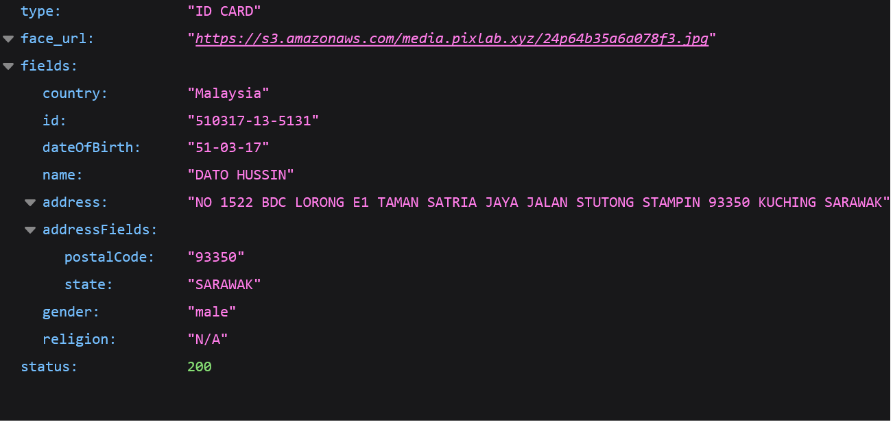

<p align="center">
    <br>
</p>


In this article, we will explore how to use the **PixLab API** to scan Malaysian ID cards, including **MyKAD**, **MyKID**, and **Malaysia Driver License**. The PixLab Document Scanner API provides an efficient and accurate solution for implementing a minimal yet functional KYC (Know Your Customer) form and identity verification for Malaysian users.

## Table of Contents

- [Introduction](#Introduction) 
- [Understanding the Format of Malaysian ID Cards:](#Format)

1. [MyKAD](#MyKAD)
2. [MyKID](#MyKID)
3. [Malaysia Driver License](#License)

- [Scanning Malaysian ID Cards with PixLab API](#Scan)

- [Implementing KYC Verification with PixLab API:](#Implement)

1. [Python code](#Python)
2. [PHP Code](#PHP)

- [Conclusion](#Conclusion)

## Introduction<a name="Introduction"></a>

Malaysian ID cards play a significant role in establishing identity and citizenship for individuals in Malaysia. MyKAD is the official identification document for citizens, MyKID is for individuals below 12 years old, and the Malaysia Driver License serves as both an ID card and a permit to drive.

## Understanding the Format of Malaysian ID Cards:<a name="Format"></a>
Before we delve into the scanning process, let's briefly understand the format of Malaysian ID cards.

**1. MyKAD:**<a name="MyKAD"></a> The Malaysian National Registration Identity Card (MyKAD) contains essential information such as name, ID number, gender, date of birth, and address. It also includes a photograph of the cardholder.

**2. MyKID:**<a name="MyKID"></a> MyKID is similar to MyKAD but is designed specifically for individuals below 12 years old. It contains the child's name, ID number, gender, date of birth, and guardian's details.

**3. Malaysia Driver License:**<a name="License"></a> The Malaysian Driver License serves as both an identification document and a permit to drive. It includes the driver's name, ID number, address, date of birth, and a photograph.

## Scanning Malaysian ID Cards with PixLab API<a name="Scan"></a>
[PixLab's](https://pixlab.io/cmd?id=docscan) Document Scanner API offers a straightforward approach to scan Malaysian ID cards. We will utilize the PixLab API's /docscan/idcard endpoint to scan the provided images of MyKAD, MyKID, and Malaysia Driver License. For each image, we will showcase the API's scan results, including the extracted information.

The [PixLab API](https://pixlab.io/cmd?id=docscan) provides a simple yet powerful solution for developers to integrate document scanning capabilities into their web applications or platforms. By leveraging advanced computer vision and machine learning algorithms, PixLab can accurately extract relevant information from scanned ID cards and passports, streamlining the KYC process for seamless identity verification.


<p align="center">
    <br>
    <em>Input ID card Specimen</em>	
</p>


<p align="center">
    <br>
    <em>Extracted ID Card Fields</em>
</p>


## Implementing KYC Verification with PixLab API<a name="Implement"></a>
Now, let's dive into the code samples provided by PixLab on their GitHub repository to scan Malaysian ID cards using  [Python](https://github.com/symisc/pixlab/blob/master/python/id_card_scan.py) and [PHP]( https://github.com/symisc/pixlab/blob/master/PHP/id_card_scan.php). These code samples demonstrate how to make API requests, handle responses, and extract information from the scanned documents.

### Python code<a name="Python"></a>
To access the Python code sample, please follow this link: https://github.com/symisc/pixlab/tree/master/python
```
import requests
import json

# Given a government issued ID card from Malaysia, Singapore, etc., extract the user face and parse all fields.
#
# Usage sample of the ID card scanner from PixLab.
#
# In this sample, we shall scan ID Card from Malaysia (MyKAD); 
# therefore we will extract the user's face, date of birth, full name, address,
# and religion if available.
#
# PixLab recommend that you connect your AWS S3 bucket via your dashboard at https://pixlab.io/dashboard
# so that any cropped face or MRZ crop is stored automatically on your S3 bucket rather than the PixLab one.
# This feature should give you full control over your analyzed media files.
#
# https://pixlab.io/cmd?id=docscan for additional information.

req = requests.get('https://api.pixlab.io/docscan',params={
	'img':'https://buletinonline.net/v7/wp-content/uploads/2016/06/Mykad-penghuni-puan-Noraini-2.jpg', # ID Card sample
	'type':'idcard', # We are expecting a Malaysian (MyKAD) ID card
	'country': 'my', # Malaysia Country Code
	'key':'PIXLAB_API_KEY' # Visit https://console.pixlab.io/ to get your API key
})
reply = req.json()
if reply['status'] != 200:
	print (reply['error'])
else:
	print ("User Cropped Face: " + reply['face_url'])
	# print ("Scanned Text: " + reply['full_text'])
	print ("Fields: ")
	# Display all scanned fields
	if "country" in reply['fields']:
		print ("\tIssuing Country: " + reply['fields']['country'])
	if "id" in reply['fields']:
		print ("\tID number: " + reply['fields']['id'])
	if "name" in reply['fields']:
		print ("\tName: " + reply['fields']['name'])
	if "address" in reply['fields']:
		print ("\tAddress: " + reply['fields']['address'])
	if "religion" in reply['fields']:
		print ("\tReligion: " + reply['fields']['religion'])
	if "sex" in reply['fields']:
		print ("\tSex: " + reply['fields']['sex'])
	if "race" in reply['fields']:
		print ("\tRace: " + reply['fields']['race'])
	if "dateOfBirth" in reply['fields']:
		print ("\tDate of birth: " + reply['fields']['dateOfBirth'])
	if "birth_country" in reply['fields']:
		print ("\tCountry of birth: " + reply['fields']['birth_country'])
	if "nationality" in reply['fields']:
		print ("\tNationality: " + reply['fields']['nationality'])

```

### PHP Code<a name="PHP"></a>
To access the PHP code sample, please follow this link: https://github.com/symisc/pixlab/tree/master/PHP

```
<?php
/*
 * Usage sample of the ID card scanner from PixLab. In this sample, we shall scan
 * ID Card from Malaysia (MyKAD); therefore we will extract the user's face, date of birth,
 * full name, address, and religion if available.
 */ 
/*
 * PixLab PHP Client which is just a single class PHP file without any dependency that you can get from Github
 * https://github.com/symisc/pixlab-php 
 */
require_once "pixlab.php";
# Given a government issued ID card from Malaysia, UAE, India, US Driver, Singapore, etc.,
# extract the user face and parse all fields.
#
# PixLab recommend that you connect your AWS S3 bucket via your dashboard at https://pixlab.io/dashboard
# so that any cropped face or MRZ crop is stored automatically on your S3 bucket rather than the PixLab one.
# This feature should give you full control over your analyzed media files.
#
# https://pixlab.io/cmd?id=docscan for additional information.

$idcard_link = 'https://buletinonline.net/v7/wp-content/uploads/2016/06/Mykad-penghuni-puan-Noraini-2.jpg';
/* ID card prototype: Of course, replace with a real government issued id. */
$key = 'PIXLAB_API_KEY'; # Your PixLab API key that you can fetch from https://pixlab.io/dsahboard
/* Process */
$pix = new Pixlab($key);
if( !$pix->get('docscan',[
	'img' => $idcard_link, # ID Card Scanned Image
	'type' => 'idcard', # Type of document we are going to scan 
	'country' => 'my' # Malysia country code
	]) ){
	echo $pix->get_error_message()."\n";
	die;
}
/* Output the scan result */
echo "User Cropped Face: " . $pix->json->face_url . "\n";
#echo "Raw Text: " . $pix->json->full_text . "\n";
echo "Fields:\n";
# At this stage, the face should be extracted and the array populated with the appropriate information.
if( isset($pix->json->country) )  echo  "Country: ".$pix->json->fields->country . "\n";
if( isset($pix->json->fields->id) )       echo  "ID: ".$pix->json->fields->id . "\n";
if( isset($pix->json->fields->name) )     echo  "Name: ".$pix->json->fields->name . "\n";
if( isset($pix->json->fields->address) )  echo  "Address: ".$pix->json->fields->address . "\n";
if( isset($pix->json->fields->religion) ) echo  "Religion: ".$pix->json->fields->religion . "\n";
if( isset($pix->json->fields->sex) )      echo  "Sex: ".$pix->json->fields->sex . "\n";
if( isset($pix->json->fields->race) )     echo  "Race: ".$pix->json->fields->race . "\n";
if( isset($pix->json->fields->birth) )    echo  "Date of birth: ".$pix->json->fields->birth . "\n";
if( isset($pix->json->fields->birth_country) ) echo  "Country of birth: ".$pix->json->fields->birth_country . "\n";
if( isset($pix->json->fields->nationality) )   echo  "Nationality: ".$pix->json->nationality . "\n";
?>

```

## Conclusion:<a name="Conclusion"></a>
Scanning Malaysian ID cards, such as **MyKAD**, **MyKID**, and **Malaysia Driver License**, using the [**PixLab API**](https://pixlab.io/cmd?id=docscan) simplifies the KYC verification process for Malaysian users. The API provides reliable and accurate information extraction, streamlining the identity verification workflow for web applications and platforms.

By incorporating the PixLab Document Scanner API into your KYC process, you can enhance the user experience, ensure compliance, and verify the authenticity of **Malaysian ID cards** efficiently. The PixLab API's powerful features, combined with the provided code samples, make it easier for developers to integrate document scanning capabilities seamlessly into their applications.

For more information on PixLab's Document Scanner API and its support for ID cards and passports, refer to their official blog post: https://blog.pixlab.io/2019/11/docscan-api-endpoint-support-id-cards-passports

Let PixLab's powerful API handle your document scanning needs and elevate your identity verification process to new levels of efficiency and accuracy. With [PixLab](https://pixlab.io/cmd?id=docscan), you can create a robust and secure KYC verification system for Malaysian users, ensuring the authenticity and credibility of your platform's user base.


dcsdc
